# Song Identification Using Audio Fingerprinting and Deep Learning

---

## Table of Contents

- [Part I: Theory & Methods](#part-i-theory--methods)
  - [1. Audio Fingerprinting — The Classical Approach](#1-audio-fingerprinting--the-classical-approach)
    - [1.1 Introduction](#11-introduction)
    - [1.2 Spectrogram Analysis & Peak Picking](#12-spectrogram-analysis--peak-picking)
    - [1.3 Pairwise Landmark Hashing](#13-pairwise-landmark-hashing)
    - [1.4 Inverted-Index Retrieval](#14-inverted-index-retrieval)
    - [1.5 Hyperparameter Optimization](#15-hyperparameter-optimization)
  - [2. Deep Learning for Song ID — A CNN Approach](#2-deep-learning-for-song-id--a-cnn-approach)
    - [2.1 Retrieval via Embeddings](#21-retrieval-via-embeddings)
    - [2.2 Contrastive Learning (InfoNCE)](#22-contrastive-learning-infonce)
    - [2.3 Input Representation: Log-Mel Spectrograms](#23-input-representation-log-mel-spectrograms)
    - [2.4 Architectures](#24-architectures)
    - [2.5 Training Strategy & Tuning](#25-training-strategy--tuning)
    - [2.6 Advanced Training Techniques](#26-advanced-training-techniques)
  - [3. State-of-the-Art with Pretrained Transformers](#3-state-of-the-art-with-pretrained-transformers)
    - [3.1 Large-Scale Pretrained Models](#31-large-scale-pretrained-models)
    - [3.2 Audio Spectrogram Transformer (AST)](#32-audio-spectrogram-transformer-ast)
    - [3.3 Music Understanding Transformer (MERT)](#33-music-understanding-transformer-mert)
- [Part II: Experiments & Results](#part-ii-experiments--results)
  - [1. Dataset Construction](#1-dataset-construction)
  - [2. Classical Landmark Fingerprinting — Results](#2-classical-landmark-fingerprinting--results)
  - [3. CNN Results](#3-cnn-results)
  - [4. Transformer Results](#4-transformer-results)
  - [5. Comparisons](#5-comparisons)
- [Conclusions](#conclusions)

---

## Part I: Theory & Methods

### 1. Audio Fingerprinting — The Classical Approach

#### 1.1 Introduction
Modern audio recognition systems rely on **audio fingerprints**—compact signatures that uniquely characterize a recording. Landmark-based algorithms (pioneered by Shazam) extract sparse, high-contrast features from the time–frequency plane. We implemented a Shazam-style fingerprinting system and explain below why each step yields robustness and speed.

#### 1.2 Spectrogram Analysis & Peak Picking
We convert a waveform to a spectrogram with STFT:

- Load: `y, sr = librosa.load(path, sr=None)`  
- STFT: `D = librosa.stft(y, n_fft=2048, hop_length=512)`  
- Magnitude → dB: `S = librosa.amplitude_to_db(np.abs(D))`

Instead of using all time–frequency bins, we select only strong local maxima (“peaks”). A point \((t_0,f_0)\) is a peak if \(|X(t_0,f_0)|\) exceeds all neighbors in a local time–frequency neighborhood.

Neighborhood sizes (time \( \tau \) and frequency \( \kappa \)) trade off density vs. salience: larger windows → fewer but stronger peaks; smaller windows → denser peaks (bigger index, higher recall). The selected peaks form a sparse **constellation map**.  
We also apply an **energy threshold**: compute per-frequency median energy and keep peaks only if their magnitude exceeds `ETH * med[f]`, suppressing noisy artifacts.

#### 1.3 Pairwise Landmark Hashing
A single peak \((t,f)\) is not distinctive enough. We pair peaks: for each **anchor** peak, select **target** peaks occurring shortly after it, and hash the tuple \((f_1, f_2, \Delta t)\) where

$$
\Delta t = t_2 - t_1.
$$

These **landmark hashes** are compact and highly discriminative.

#### 1.4 Inverted-Index Retrieval
All hashes are stored in an inverted index mapping `hash → [(songID, timeOffset), ...]`. At query time, we hash the incoming audio, look up matches, and compute offsets

$$
\delta t = t_{\text{db}} - t_{\text{query}},
$$

then vote for each \((\text{songID}, \delta t)\). The correct song surfaces as a sharp vote cluster at a consistent offset—robust to noise and partial matches.

#### 1.5 Hyperparameter Optimization
Key parameters and why they matter:

- **Peak Neighborhood Size (PNS):** window for local maxima. Smaller PNS → denser peaks (higher recall; bigger index). Larger PNS → sparser constellation (more salience).
- **Fan (pairings per anchor):** controls *target zone* density. Larger Fan (e.g., 50) yields more hashes per anchor (better recall; more collisions risk).
- **Energy Threshold (ETH):** filters low-energy peaks. Lower ETH (e.g., 0.3) retains only peaks above a stronger relative baseline, reducing spurious landmarks.

---

### 2. Deep Learning for Song ID — A CNN Approach

#### 2.1 Retrieval via Embeddings
We formulate song ID as **embedding retrieval**. A model maps clips to vectors so that two segments from the same song are close (high cosine similarity), and segments from different songs are far apart. Inference computes the query embedding and performs nearest-neighbor search among stored song embeddings.

#### 2.2 Contrastive Learning (InfoNCE)
We train with **InfoNCE**. For each anchor \(x\), a positive \(x^+\) is another segment from the same song; negatives \(x^-_i\) are from other songs in the batch. With cosine similarity \(\mathrm{sim}(\cdot,\cdot)\) and temperature \(\tau\):

$$
L_{\mathrm{InfoNCE}} = -\log
\frac{\exp(\mathrm{sim}(x,x^+)/\tau)}
{\exp(\mathrm{sim}(x,x^+)/\tau) + \sum_i \exp(\mathrm{sim}(x,x^-_i)/\tau)}.
$$

Smaller \(\tau\) sharpens the softmax and emphasizes hard negatives. We tuned \(\tau \in \{0.07, 0.1\}\).

#### 2.3 Input Representation: Log-Mel Spectrograms
We convert each clip to a log-mel spectrogram (e.g., 64 mel bins) and treat it as a single-channel image. This compresses dynamic range and aligns frequency resolution with human hearing. CNNs then learn local time–frequency patterns (harmonics, onsets, rhythms).

#### 2.4 Architectures
- **Baseline Encoder (3-Layer CNN):** three conv blocks (Conv-BN-ReLU-MaxPool), channels 32→64→128, global pooling to a 128-D embedding plus a classification head. Proof-of-concept with moderate accuracy.
- **Enhanced Encoder (4-Layer CNN):** deeper conv stack, e.g., 64→128→256→512 with adaptive average pooling to a 256-D embedding. Increased capacity captures richer invariances; regularized with BN, augmentation, and early stopping.

#### 2.5 Training Strategy & Tuning
**Hybrid loss:** contrastive + classification:

$$
L_{\mathrm{total}} =
L_{\mathrm{InfoNCE}} + \alpha \,\bigl(L_{\mathrm{CE},\text{clip1}} + L_{\mathrm{CE},\text{clip2}}\bigr).
$$

A small \(\alpha\) keeps retrieval geometry primary while using supervised signals to stabilize features. Final best: LR \(=10^{-4}\), batch size \(=32\), embedding dim \(=256\), \(\tau=0.07\), \(\alpha=0.25\), Adam optimizer, up to 15 epochs with Reduce-on-Plateau scheduler.

**Batch size:** larger batches provide more in-batch negatives (better contrastive signal) but can hurt generalization. We used 32 due to hardware/memory.

#### 2.6 Advanced Training Techniques
- **Optimizers:** Adam vs. AdamW (decoupled weight decay). In our setup, AdamW did not outperform Adam.
- **LR scheduling:** Reduce-on-Plateau and Cosine Annealing both helped over fixed LR.
- **Augmentation:**  
  - **SpecAugment** (time/frequency masks, mild time warping) improved robustness.  
  - **Waveform augmentations** (time-stretch, pitch-shift, noise/gain/compression) were less helpful overall in our settings.

---

### 3. State-of-the-Art with Pretrained Transformers

#### 3.1 Large-Scale Pretrained Models
We evaluated **Audio Spectrogram Transformer (AST)** and **Music Understanding Transformer (MERT)**—self-attention encoders pretrained at scale, providing powerful audio/music representations.

#### 3.2 Audio Spectrogram Transformer (AST)
**Architecture:** a ViT-style model over spectrogram patches. Self-attention captures long-range time–frequency dependencies.

**Fine-tuning enhancements:**
- **Attention pooling:** learn to weight frames by importance before forming a clip-level embedding.
- **Learnable temperature \(\tau\)** for contrastive loss: lets training adapt similarity scaling.
- **Multi-sample dropout:** averages multiple dropout-perturbed heads to stabilize training.
- **Label smoothing** in the classification head for regularization.

#### 3.3 Music Understanding Transformer (MERT)
**Architecture & pretraining:** transformer encoder trained with music-specific self-supervision (e.g., masked acoustic modeling with teacher signals), yielding strong melody/pitch/structure awareness.

**Fine-tuning enhancements:** the same set as AST (attention pooling, learnable \(\tau\), label smoothing). MERT proved especially robust under noise.

---

## Part II: Experiments & Results

### 1. Dataset Construction
Using the Jamendo API we downloaded **1,000** tracks and, after filtering invalid items, retained **989** unique songs. We split **791 / 198** for train/validation (80/20). For generalization we collected another **200** disjoint tracks as a held-out **test** set. Audio is MP3; metadata (track id, title, artist, album, duration, genre) live in `metadata.csv`.

---

### 2. Classical Landmark Fingerprinting — Results

**Grid-search over PNS, FAN, ETH (Top-1 Accuracy & Latency):**

Show full grid (click to expand)

| Label | PNS | FAN | ETH | Accuracy | Latency (s) |
|---|---:|---:|---:|---:|---:|
| PNS=20\_FAN=15\_ETH=0.3 | 20 | 15 | 0.3 | 0.875632 | 0.593492 |
| PNS=20\_FAN=15\_ETH=0.5 | 20 | 15 | 0.5 | 0.857432 | 0.593995 |
| PNS=20\_FAN=15\_ETH=0.7 | 20 | 15 | 0.7 | 0.803842 | 0.589477 |
| PNS=20\_FAN=30\_ETH=0.3 | 20 | 30 | 0.3 | 0.914055 | 0.603808 |
| PNS=20\_FAN=30\_ETH=0.5 | 20 | 30 | 0.5 | 0.887765 | 0.608314 |
| PNS=20\_FAN=30\_ETH=0.7 | 20 | 30 | 0.7 | 0.847321 | 0.595650 |
| **PNS=20\_FAN=50\_ETH=0.3** | **20** | **50** | **0.3** | **0.940344** | **0.637148** |
| PNS=20\_FAN=50\_ETH=0.5 | 20 | 50 | 0.5 | 0.901921 | 0.623506 |
| PNS=20\_FAN=50\_ETH=0.7 | 20 | 50 | 0.7 | 0.880688 | 0.618405 |
| PNS=30\_FAN=15\_ETH=0.3 | 30 | 15 | 0.3 | 0.753286 | 0.618855 |
| PNS=30\_FAN=15\_ETH=0.5 | 30 | 15 | 0.5 | 0.709808 | 0.632791 |
| PNS=30\_FAN=15\_ETH=0.7 | 30 | 15 | 0.7 | 0.676441 | 0.641774 |
| PNS=30\_FAN=30\_ETH=0.3 | 30 | 30 | 0.3 | 0.807887 | 0.647252 |
| PNS=30\_FAN=30\_ETH=0.5 | 30 | 30 | 0.5 | 0.795753 | 0.589047 |
| PNS=30\_FAN=30\_ETH=0.7 | 30 | 30 | 0.7 | 0.767442 | 0.585295 |
| PNS=30\_FAN=50\_ETH=0.3 | 30 | 50 | 0.3 | 0.878665 | 0.593647 |
| PNS=30\_FAN=50\_ETH=0.5 | 30 | 50 | 0.5 | 0.839232 | 0.581981 |
| PNS=30\_FAN=50\_ETH=0.7 | 30 | 50 | 0.7 | 0.839232 | 0.581275 |
| PNS=40\_FAN=15\_ETH=0.3 | 40 | 15 | 0.3 | 0.560162 | 0.570391 |
| PNS=40\_FAN=15\_ETH=0.5 | 40 | 15 | 0.5 | 0.564206 | 0.568640 |
| PNS=40\_FAN=15\_ETH=0.7 | 40 | 15 | 0.7 | 0.521739 | 0.566893 |
| PNS=40\_FAN=30\_ETH=0.3 | 40 | 30 | 0.3 | 0.736097 | 0.569670 |
| PNS=40\_FAN=30\_ETH=0.5 | 40 | 30 | 0.5 | 0.711830 | 0.574928 |
| PNS=40\_FAN=30\_ETH=0.7 | 40 | 30 | 0.7 | 0.669363 | 0.569679 |
| PNS=40\_FAN=50\_ETH=0.3 | 40 | 50 | 0.3 | 0.816987 | 0.572586 |
| PNS=40\_FAN=50\_ETH=0.5 | 40 | 50 | 0.5 | 0.792720 | 0.573016 |
| PNS=40\_FAN=50\_ETH=0.7 | 40 | 50 | 0.7 | 0.772497 | 0.572708 |

**Best** Top-1 accuracy (5s clean, 1,000 songs): **94.0%** with **(PNS=20, FAN=50, ETH=0.3)**.

**Accuracy vs. clip length / noise (Top-1 & Top-5, 1,000 songs):**

- Top-1:

| SNR / Duration | 2 s | 5 s | 10 s |
|---|---:|---:|---:|
| 20 dB | 43.4% | 89.3% | 97.0% |
| 10 dB | 29.7% | 83.3% | 96.1% |
| 0 dB  | 14.6% | 62.1% | 89.3% |

- Top-5:

| SNR / Duration | 2 s | 5 s | 10 s |
|---|---:|---:|---:|
| 20 dB | 57.2% | 92.5% | 98.4% |
| 10 dB | 41.7% | 89.7% | 97.7% |
| 0 dB  | 23.6% | 73.5% | 94.2% |

**Accuracy vs. clip length / noise (Top-1 & Top-5, 200-song test set):**

- Top-1:

| SNR / Duration | 2 s | 5 s | 10 s |
|---|---:|---:|---:|
| 20 dB | 47.0% | 95.5% | 97.0% |
| 10 dB | 35.7% | 85.5% | 98.5% |
| 0 dB  | 21.0% | 67.0% | 91.0% |

- Top-5:

| SNR / Duration | 2 s | 5 s | 10 s |
|---|---:|---:|---:|
| 20 dB | 63.0% | 96.5% | 99.0% |
| 10 dB | 50.5% | 91.0% | 98.5% |
| 0 dB  | 34.0% | 80.0% | 95.5% |

**Plots (1,000-song tuning set):**

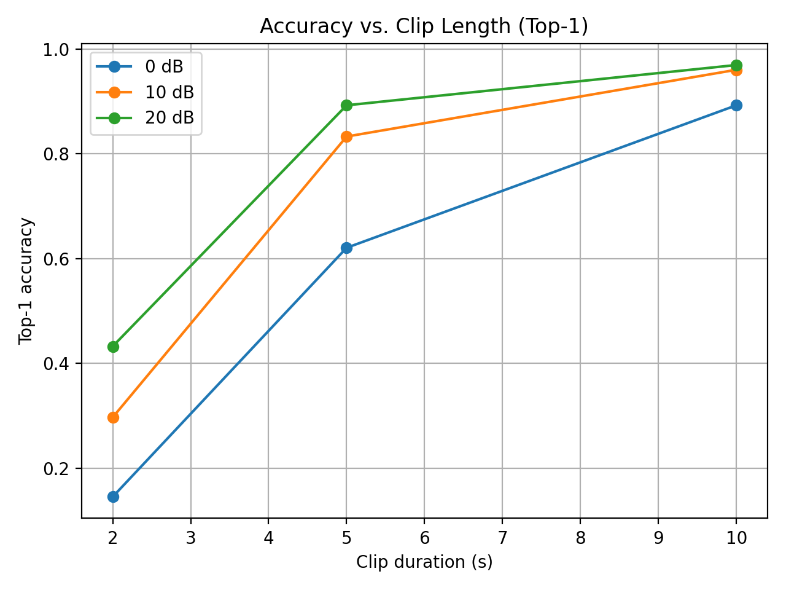  
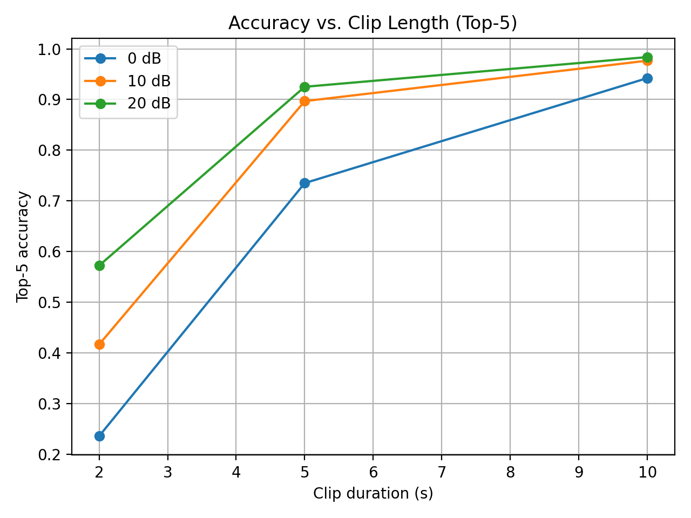  
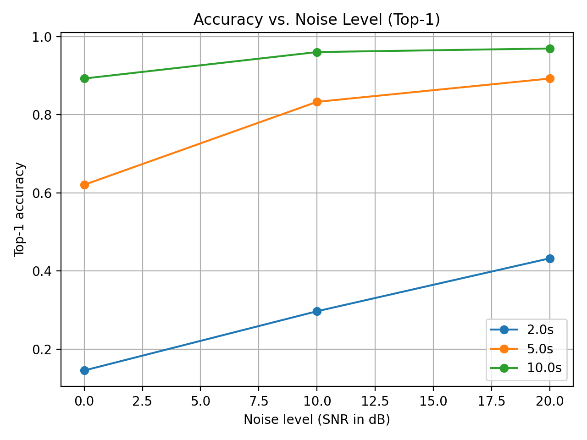  
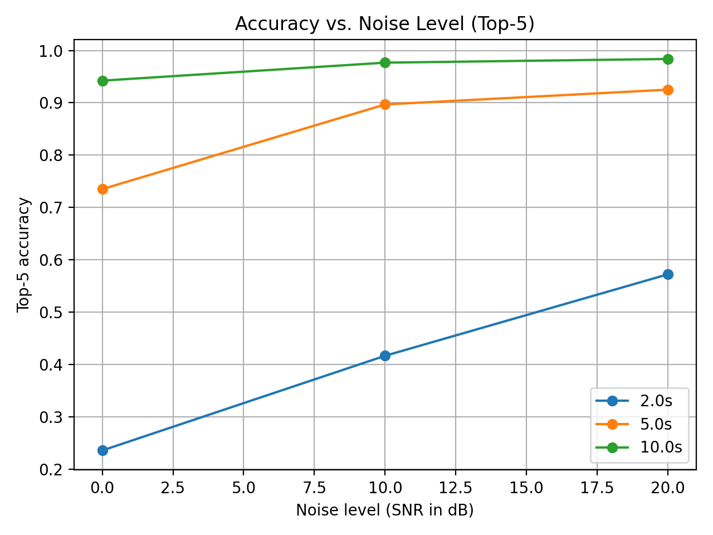  
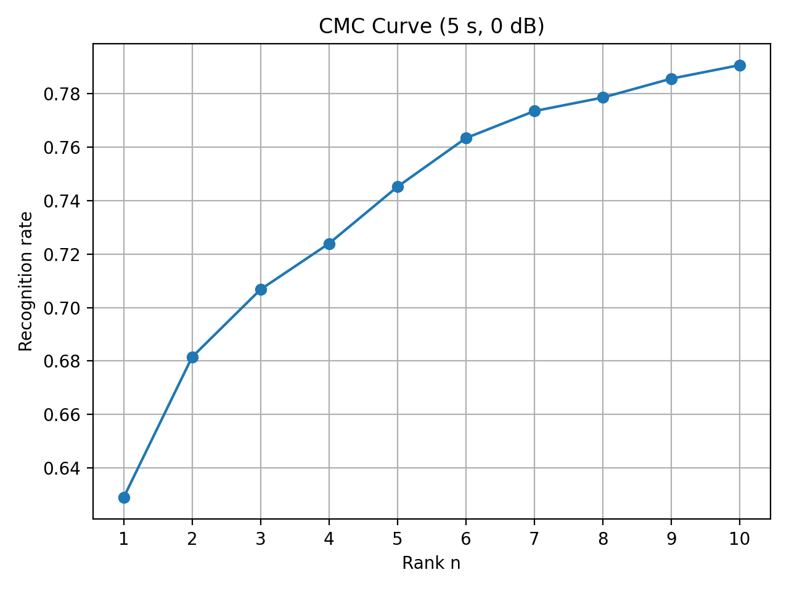

**Plots (200-song test set):**

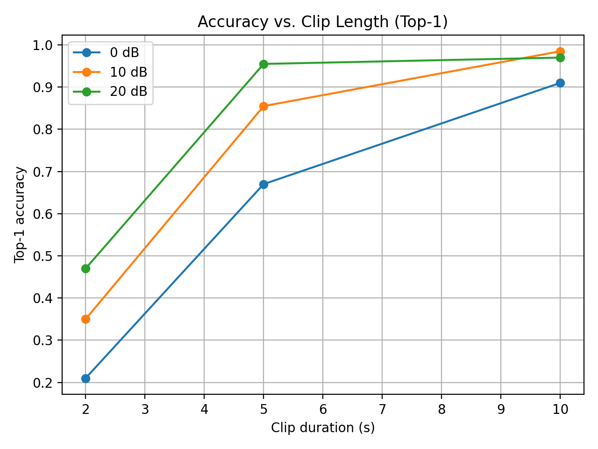  
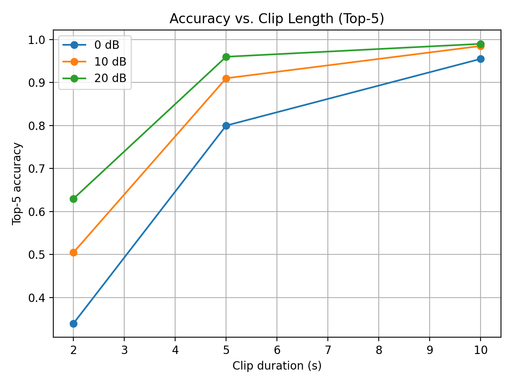  
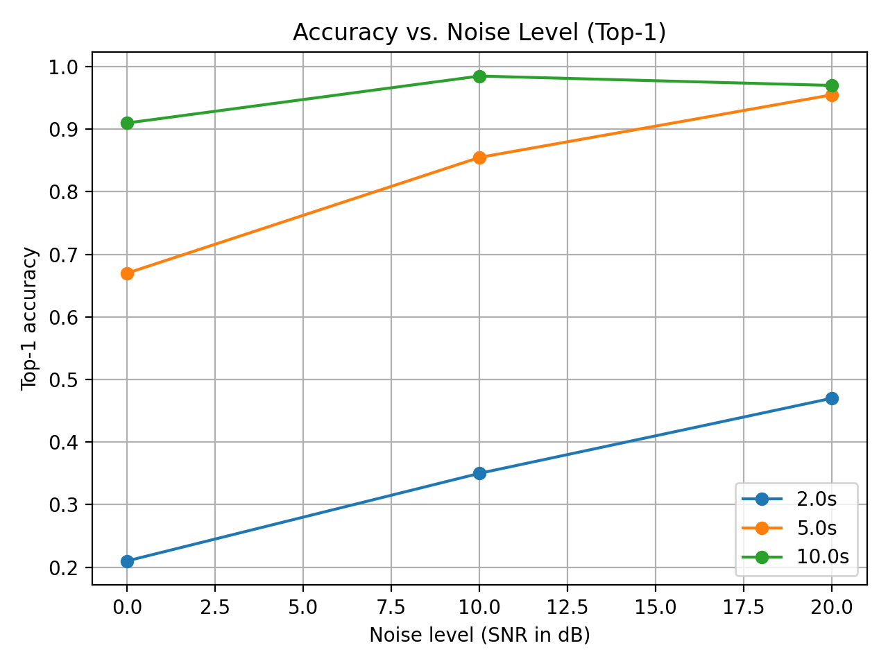  
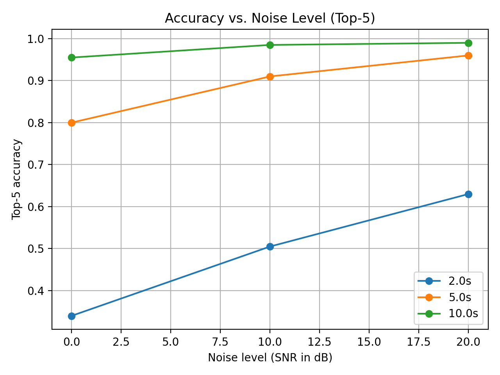  
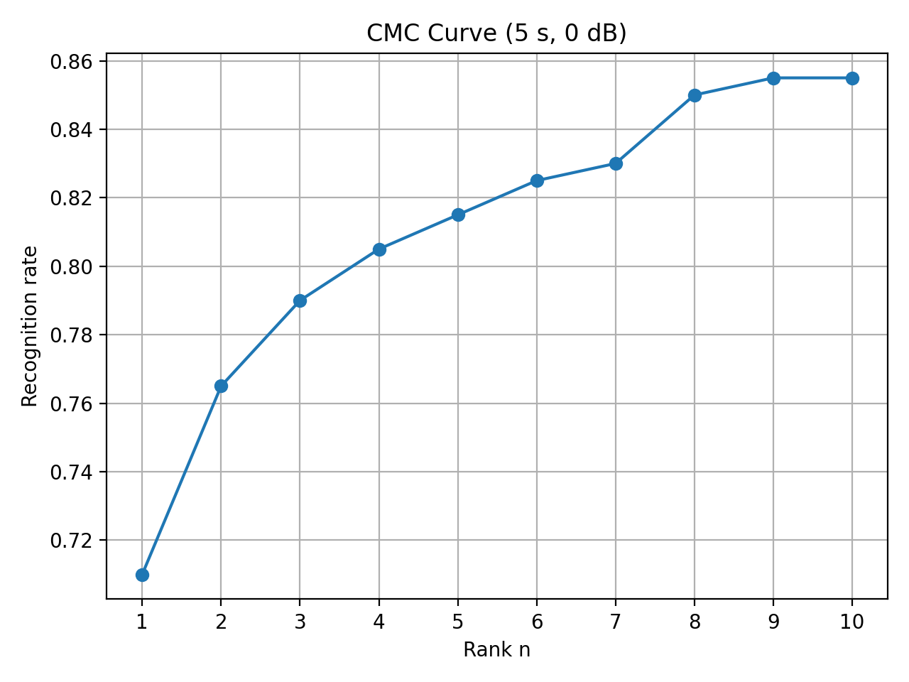

---

### 3. CNN Results

#### 3.1 Baseline 3-Layer CNN
**Default config:** `BATCH_SIZE=64`, `EPOCHS=15`, `LR=1e-3`, `TEMP=0.1`, `ALPHA=1.0`, `EMB_DIM=128`. Results on the 200-song test:

- Top-1:

| SNR / Duration | 2 s | 5 s | 10 s |
|---|---:|---:|---:|
| Clean | 54.00% | 59.00% | 62.50% |
| 20 dB | 35.50% | 48.50% | 52.00% |
| 10 dB | 19.50% | 31.50% | 32.50% |
| 0 dB  |  9.00% |  8.50% |  9.50% |

- Top-5:

| SNR / Duration | 2 s | 5 s | 10 s |
|---|---:|---:|---:|
| Clean | 66.00% | 67.50% | 71.50% |
| 20 dB | 55.00% | 59.50% | 64.00% |
| 10 dB | 40.00% | 42.00% | 40.00% |
| 0 dB  | 11.00% | 14.00% | 15.00% |

#### 3.2 4-Layer CNN — Grid Search (5 s, clean, validation)

Show full grid (click to expand)

| LR | τ | α | Dim | Ep. | Batch | Val Loss | Val Acc (%) |
|---:|---:|---:|---:|---:|---:|---:|---:|
| 0.0001 | 0.07 | 0.25 | 128 | 15 | 32 | 6.292580 | 64.04698 |
| 0.0001 | 0.07 | 0.25 | 128 | 15 | 64 | 7.335290 | 47.61074 |
| **0.0001** | **0.07** | **0.25** | **256** | **15** | **32** | **5.963996** | **71.42953** |
| 0.0001 | 0.07 | 0.25 | 256 | 15 | 64 | 7.286747 | 64.71812 |
| 0.0001 | 0.07 | 0.50 | 128 | 15 | 32 | 9.596525 | 67.40268 |
| 0.0001 | 0.07 | 0.50 | 128 | 15 | 64 | 10.842608 | 62.70470 |
| 0.0001 | 0.07 | 0.50 | 256 | 15 | 32 | 9.302552 | 70.08725 |
| 0.0001 | 0.07 | 0.50 | 256 | 15 | 64 | 10.854216 | 64.04698 |
| 0.0001 | 0.07 | 0.75 | 128 | 15 | 32 | 12.792898 | 65.38926 |
| 0.0001 | 0.07 | 0.75 | 128 | 15 | 64 | 14.163148 | 67.40268 |
| 0.0001 | 0.07 | 0.75 | 256 | 15 | 32 | 12.853767 | 66.06040 |
| 0.0001 | 0.07 | 0.75 | 256 | 15 | 64 | 14.019282 | 60.02013 |
| 0.0001 | 0.10 | 0.25 | 128 | 15 | 32 | 5.919953 | 69.41611 |
| 0.0001 | 0.10 | 0.25 | 128 | 15 | 64 | 7.348520 | 62.70470 |
| 0.0001 | 0.10 | 0.25 | 256 | 15 | 32 | 6.023814 | 59.34899 |
| 0.0001 | 0.10 | 0.25 | 256 | 15 | 64 | 7.345748 | 58.67785 |
| 0.0001 | 0.10 | 0.50 | 128 | 15 | 32 | 9.498577 | 59.73154 |
| 0.0001 | 0.10 | 0.50 | 128 | 15 | 64 | 10.707890 | 55.32215 |
| 0.0001 | 0.10 | 0.50 | 256 | 15 | 32 | 9.156086 | 71.10067 |
| 0.0001 | 0.10 | 0.50 | 256 | 15 | 64 | 10.928786 | 64.04698 |
| 0.0001 | 0.10 | 0.75 | 128 | 15 | 32 | 12.817372 | 69.41611 |
| 0.0001 | 0.10 | 0.75 | 128 | 15 | 64 | 14.366496 | 58.67785 |
| 0.0001 | 0.10 | 0.75 | 256 | 15 | 32 | 12.783500 | 70.75839 |
| 0.0001 | 0.10 | 0.75 | 256 | 15 | 64 | 14.362817 | 62.70470 |
| 0.0005 | 0.07 | 0.25 | 128 | 15 | 32 | 6.226688 | 59.34899 |
| 0.0005 | 0.07 | 0.25 | 128 | 15 | 64 | 6.547420 | 63.37584 |
| 0.0005 | 0.07 | 0.25 | 256 | 15 | 32 | 6.035327 | 68.74497 |
| 0.0005 | 0.07 | 0.25 | 256 | 15 | 64 | 6.702687 | 69.41611 |
| 0.0005 | 0.07 | 0.50 | 128 | 15 | 32 | 9.579094 | 55.32215 |
| 0.0005 | 0.07 | 0.50 | 128 | 15 | 64 | 10.484405 | 66.73154 |
| 0.0005 | 0.07 | 0.50 | 256 | 15 | 32 | 9.533671 | 68.07383 |
| 0.0005 | 0.07 | 0.50 | 256 | 15 | 64 | 10.100034 | 62.03356 |
| 0.0005 | 0.07 | 0.75 | 128 | 15 | 32 | 13.092276 | 56.66443 |
| 0.0005 | 0.07 | 0.75 | 128 | 15 | 64 | 13.816619 | 60.02013 |
| 0.0005 | 0.07 | 0.75 | 256 | 15 | 32 | 13.052927 | 60.69128 |
| 0.0005 | 0.07 | 0.75 | 256 | 15 | 64 | 13.750700 | 58.67785 |
| 0.0005 | 0.10 | 0.25 | 128 | 15 | 32 | 6.237953 | 59.34899 |
| 0.0005 | 0.10 | 0.25 | 128 | 15 | 64 | 6.803458 | 68.07383 |
| 0.0005 | 0.10 | 0.25 | 256 | 15 | 32 | 5.878330 | 66.06040 |
| 0.0005 | 0.10 | 0.25 | 256 | 15 | 64 | 6.936547 | 64.04698 |
| 0.0005 | 0.10 | 0.50 | 128 | 15 | 32 | 9.540131 | 64.71812 |
| 0.0005 | 0.10 | 0.50 | 128 | 15 | 64 | 10.201151 | 58.00671 |
| 0.0005 | 0.10 | 0.50 | 256 | 15 | 32 | 9.830219 | 69.41611 |
| 0.0005 | 0.10 | 0.50 | 256 | 15 | 64 | 10.392408 | 64.04698 |
| 0.0005 | 0.10 | 0.75 | 128 | 15 | 32 | 13.015230 | 64.04698 |
| 0.0005 | 0.10 | 0.75 | 128 | 15 | 64 | 13.481024 | 58.00671 |
| 0.0005 | 0.10 | 0.75 | 256 | 15 | 32 | 13.165791 | 68.07383 |
| 0.0005 | 0.10 | 0.75 | 256 | 15 | 64 | 13.586086 | 62.70470 |

#### 3.3 Optimizer / Scheduler / Augmentation Grid  
*(fixed: batch=32, LR=1e-4, emb=256, temp=0.07, alpha=0.25)*

Show table (click to expand)

| Optimiser | Scheduler | Model | Augment. | Acc (%) | Time (min) |
|---|---|---|---|---:|---:|
| Adam | ReduceLROnPlateau | Encoder3Layer | none | 60.02 | 81.66 |
| Adam | ReduceLROnPlateau | Encoder3Layer | specaugment | 62.53 | 94.88 |
| Adam | ReduceLROnPlateau | Encoder3Layer | audioment_light | 62.02 | 95.95 |
| Adam | ReduceLROnPlateau | Encoder3Layer | audioment_heavy | 66.06 | 96.77 |
| Adam | ReduceLROnPlateau | Encoder4Layer | none | 64.55 | 94.74 |
| **Adam** | **ReduceLROnPlateau** | **Encoder4Layer** | **specaugment** | **70.53** | **94.89** |
| Adam | ReduceLROnPlateau | Encoder4Layer | audioment_light | 69.49 | 95.94 |
| Adam | ReduceLROnPlateau | Encoder4Layer | audioment_heavy | 67.47 | 96.84 |
| Adam | CosineAnnealingLR | Encoder3Layer | none | 61.03 | 39.88 |
| Adam | CosineAnnealingLR | Encoder3Layer | specaugment | 64.55 | 94.93 |
| Adam | CosineAnnealingLR | Encoder3Layer | audioment_light | 66.97 | 95.93 |
| Adam | CosineAnnealingLR | Encoder3Layer | audioment_heavy | 67.07 | 96.73 |
| Adam | CosineAnnealingLR | Encoder4Layer | none | 63.06 | 94.88 |
| Adam | CosineAnnealingLR | Encoder4Layer | specaugment | 69.49 | 94.87 |
| Adam | CosineAnnealingLR | Encoder4Layer | audioment_light | 67.07 | 95.91 |
| Adam | CosineAnnealingLR | Encoder4Layer | audioment_heavy | 68.01 | 96.75 |
| AdamW | ReduceLROnPlateau | Encoder3Layer | none | 61.57 | 94.82 |
| AdamW | ReduceLROnPlateau | Encoder3Layer | specaugment | 62.53 | 94.83 |
| AdamW | ReduceLROnPlateau | Encoder3Layer | audioment_light | 62.02 | 95.85 |
| AdamW | ReduceLROnPlateau | Encoder3Layer | audioment_heavy | 66.06 | 96.77 |
| AdamW | ReduceLROnPlateau | Encoder4Layer | none | 65.04 | 94.98 |
| AdamW | ReduceLROnPlateau | Encoder4Layer | specaugment | 69.52 | 95.03 |
| AdamW | ReduceLROnPlateau | Encoder4Layer | audioment_light | 64.49 | 95.98 |
| AdamW | ReduceLROnPlateau | Encoder4Layer | audioment_heavy | 67.47 | 96.75 |
| AdamW | CosineAnnealingLR | Encoder3Layer | none | 63.54 | 94.84 |
| AdamW | CosineAnnealingLR | Encoder3Layer | specaugment | 64.49 | 94.89 |
| AdamW | CosineAnnealingLR | Encoder3Layer | audioment_light | 66.97 | 95.94 |
| AdamW | CosineAnnealingLR | Encoder3Layer | audioment_heavy | 67.07 | 96.79 |
| AdamW | CosineAnnealingLR | Encoder4Layer | none | 64.55 | 94.93 |
| AdamW | CosineAnnealingLR | Encoder4Layer | specaugment | 66.49 | 94.88 |
| AdamW | CosineAnnealingLR | Encoder4Layer | audioment_light | 68.01 | 95.96 |
| AdamW | CosineAnnealingLR | Encoder4Layer | audioment_heavy | 68.01 | 96.77 |

#### 3.4 Enhanced CNN — Test Results (200 songs)

- Top-1:

| SNR / Duration | 2 s | 5 s | 10 s |
|---|---:|---:|---:|
| Clean | 56.50% | 71.50% | 73.50% |
| 20 dB | 45.00% | 59.50% | 57.50% |
| 10 dB | 31.50% | 38.00% | 43.00% |
| 0 dB  | 14.50% | 12.50% | 15.00% |

- Top-5:

| SNR / Duration | 2 s | 5 s | 10 s |
|---|---:|---:|---:|
| Clean | 71.50% | 73.00% | 82.00% |
| 20 dB | 62.00% | 66.00% | 72.00% |
| 10 dB | 48.00% | 49.00% | 52.00% |
| 0 dB  | 21.00% | 18.50% | 23.00% |

**Embedding similarity distributions:**

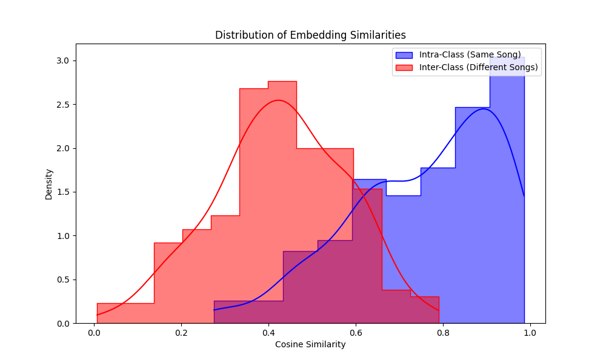  
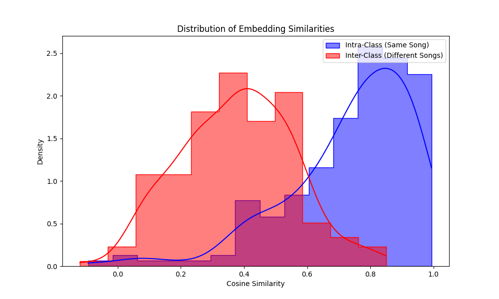

**t-SNE of embeddings by genre:**

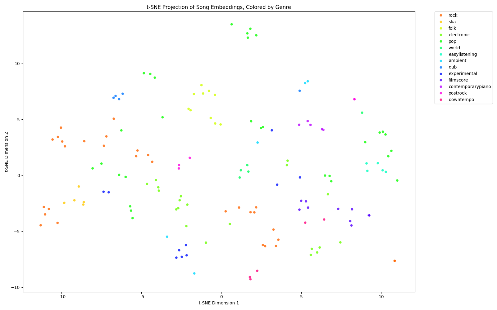  
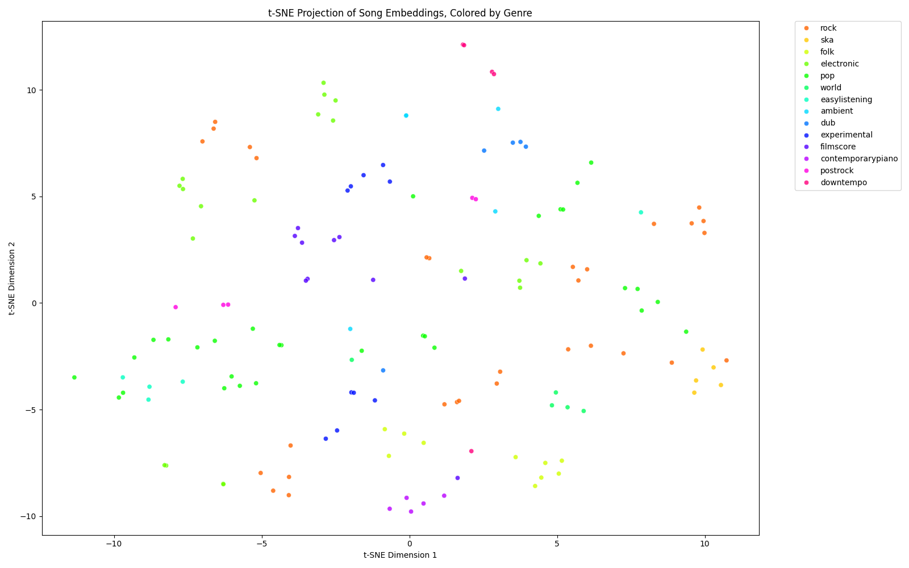

---

### 4. Transformer Results

#### 4.1 Audio Spectrogram Transformer (AST)

**Baseline AST (200-song test):**

- Top-1:

| SNR / Duration | 2 s | 5 s | 10 s |
|---|---:|---:|---:|
| Clean | 51.50% | 78.50% | 72.00% |
| 20 dB | 42.50% | 73.50% | 67.00% |
| 10 dB | 32.50% | 71.50% | 62.00% |
| 0 dB  | 15.50% | 50.00% | 47.50% |

- Top-5:

| SNR / Duration | 2 s | 5 s | 10 s |
|---|---:|---:|---:|
| Clean | 71.00% | 89.00% | 89.50% |
| 20 dB | 69.00% | 86.00% | 87.00% |
| 10 dB | 51.50% | 86.00% | 83.00% |
| 0 dB  | 30.50% | 73.00% | 76.50% |

**Enhanced AST** *(attention pooling, learnable \(\tau\), multi-sample dropout, label smoothing)*:

- Top-1:

| SNR / Duration | 2 s | 5 s | 10 s |
|---|---:|---:|---:|
| Clean | 54.50% | 74.50% | 75.50% |
| 20 dB | 42.50% | 75.00% | 70.50% |
| 10 dB | 33.50% | 71.00% | 65.50% |
| 0 dB  | 15.50% | 50.50% | 50.00% |

- Top-5:

| SNR / Duration | 2 s | 5 s | 10 s |
|---|---:|---:|---:|
| Clean | 74.50% | 89.00% | 90.00% |
| 20 dB | 65.50% | 89.00% | 88.00% |
| 10 dB | 55.00% | 80.50% | 82.00% |
| 0 dB  | 33.50% | 66.00% | 73.00% |

**Embedding similarity distributions:**

  

**t-SNE by genre:**

  

#### 4.2 Music Understanding Transformer (MERT)

**Baseline MERT (200-song test):**

- Top-1:

| SNR / Duration | 2 s | 5 s | 10 s |
|---|---:|---:|---:|
| Clean | 51.50% | 84.50% | 85.00% |
| 20 dB | 55.50% | 77.50% | 84.00% |
| 10 dB | 50.00% | 69.50% | 80.00% |
| 0 dB  | 42.00% | 61.50% | 61.00% |

- Top-5:

| SNR / Duration | 2 s | 5 s | 10 s |
|---|---:|---:|---:|
| Clean | 71.00% | 91.00% | 94.00% |
| 20 dB | 68.00% | 91.00% | 89.50% |
| 10 dB | 68.50% | 82.50% | 91.50% |
| 0 dB  | 63.00% | 79.50% | 78.00% |

**Enhanced MERT** *(attention pooling, learnable \(\tau\), label smoothing)*:

- Top-1:

| SNR / Duration | 2 s | 5 s | 10 s |
|---|---:|---:|---:|
| Clean | 67.00% | 84.00% | 86.50% |
| 20 dB | 56.00% | 75.50% | 85.00% |
| 10 dB | 54.50% | 69.50% | 84.50% |
| 0 dB  | 49.50% | 61.50% | 61.50% |

- Top-5:

| SNR / Duration | 2 s | 5 s | 10 s |
|---|---:|---:|---:|
| Clean | 78.50% | 92.00% | 91.00% |
| 20 dB | 77.50% | 91.50% | 92.50% |
| 10 dB | 78.50% | 87.00% | 91.00% |
| 0 dB  | 62.00% | 77.00% | 72.50% |

**Embedding similarity distributions:**

  

**t-SNE by genre:**

  

---

### 5. Comparisons

- **Fingerprinting vs. Learning-Based:** Classical fingerprinting reaches **~89–94% Top-1** on clean 5-second clips, exceeding all CNNs and some transformer variants in low-noise conditions.
- **CNN Baseline vs. Enhanced:** 3-layer CNN achieves **~59%** Top-1 (clean 5 s); 4-layer with tuning and SpecAugment reaches **~71%** (+12 pp).
- **AST vs. CNN:** Baseline AST **78.5%** Top-1 (clean 5 s) > Enhanced CNN **71.5%**.
- **AST Fine-tuning:** With attention pooling etc., Top-1 on clean 5 s remains around the same or slightly lower—suggesting baseline AST is already strong.
- **MERT vs. AST:** MERT hits **~84.5%** Top-1 (clean 5 s) and is more robust to heavy noise (**0 dB:** 42% vs. 15.5% for AST).
- **Enhanced MERT:** Advanced fine-tuning lifts clean 5 s Top-1 to **~86.5%** and maintains strong performance across conditions.
- **Top-5 Trends:** Transformers (AST, MERT) yield **>90% Top-5** on clean 5 s and degrade more gracefully with noise than CNNs.

**Triplet analyses (200-song test, MERT embeddings):**

- *Most dissimilar* triplets (lowest mean cosine):

| Song A | Song B | Song C | Avg. Cosine |
|---:|---:|---:|---:|
| 4883 | 5988 | 8832 | 0.6083 |
| 5988 | 6571 | 9201 | 0.6106 |
| 4883 | 5988 | 6297 | 0.6149 |
| 5988 | 6571 | 8832 | 0.6165 |
| 5988 | 6297 | 9201 | 0.6167 |

- *Most similar* triplets (highest mean cosine):

| Song A | Song B | Song C | Avg. Cosine |
|---:|---:|---:|---:|
| 7197 | 7202 | 7203 | 0.9737 |
| 5750 | 5751 | 5753 | 0.9659 |
| 1105 | 7197 | 7202 | 0.9640 |
| 220  | 225  | 3435 | 0.9626 |
| 5750 | 5752 | 5753 | 0.9615 |

**Cosine-similarity heatmaps — most similar triplets:**

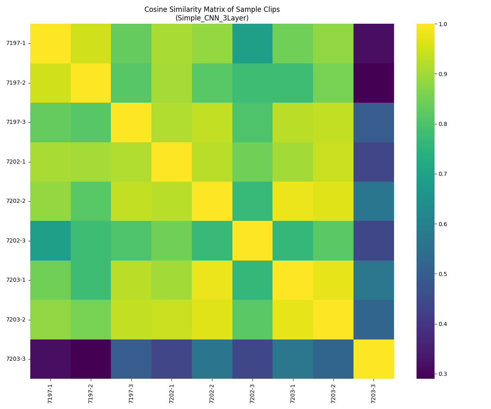  
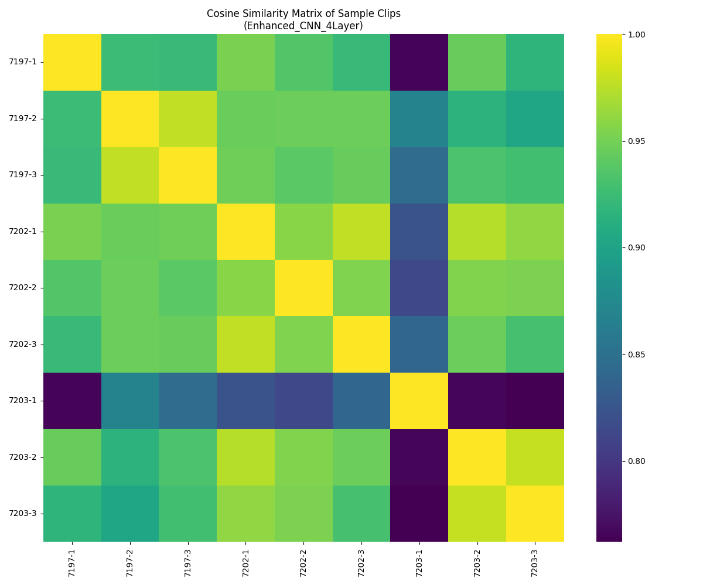  
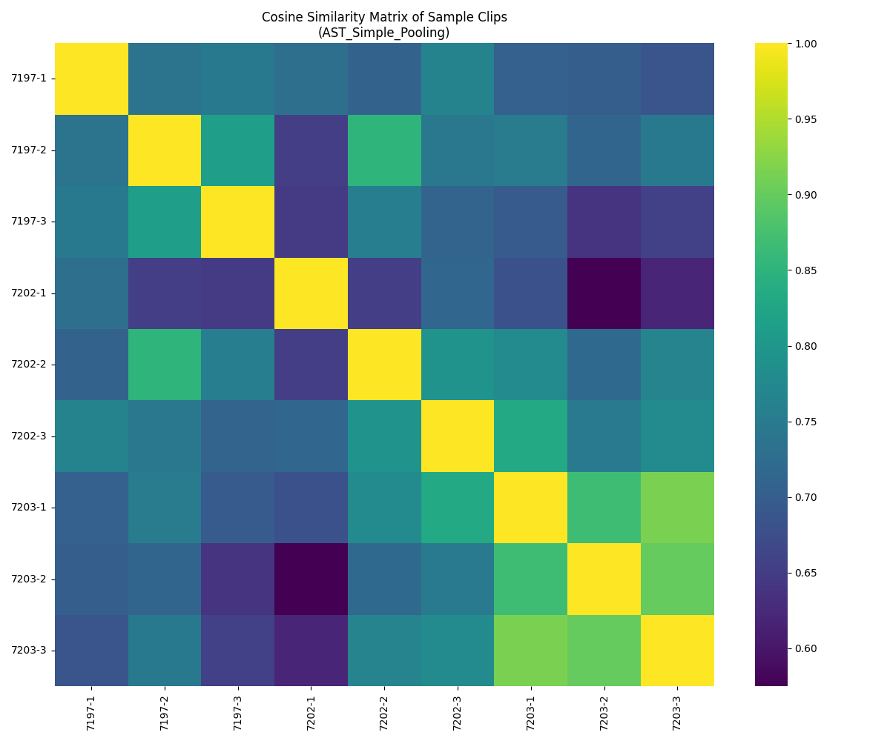  
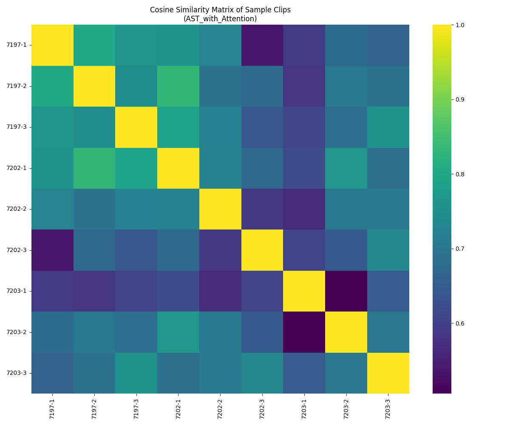  
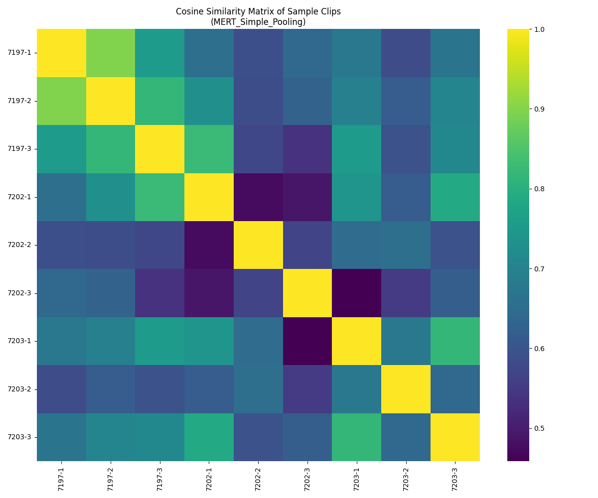  
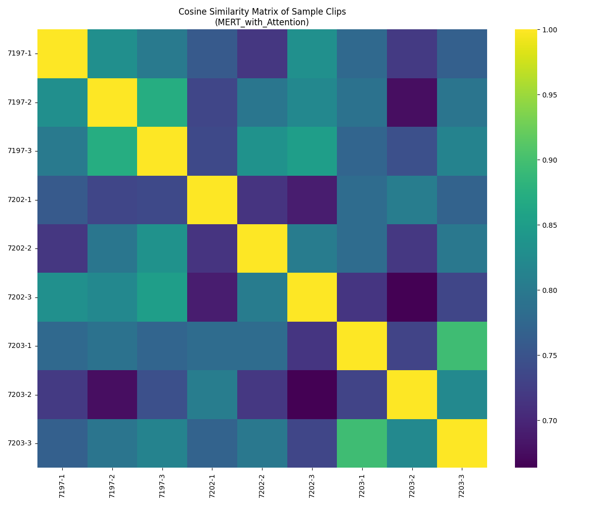

**Cosine-similarity heatmaps — most dissimilar triplets:**

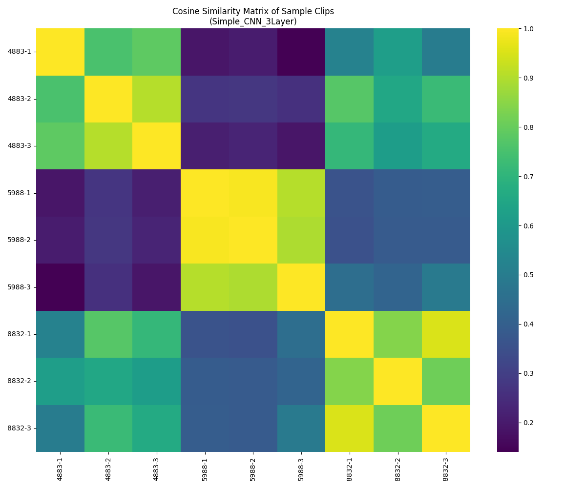  
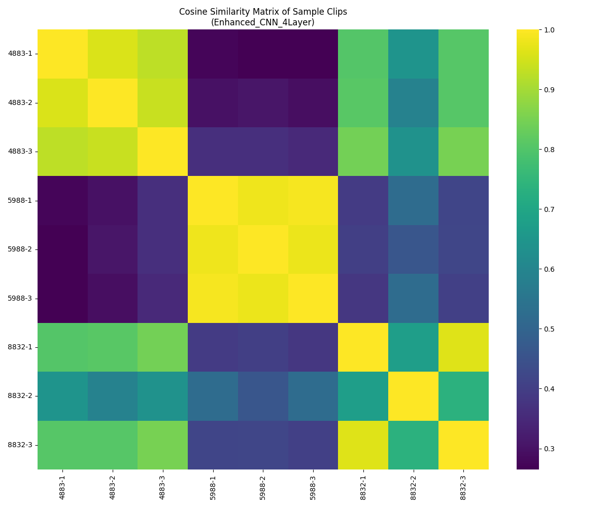  
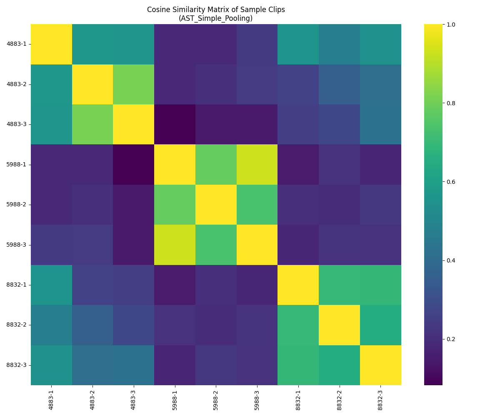  
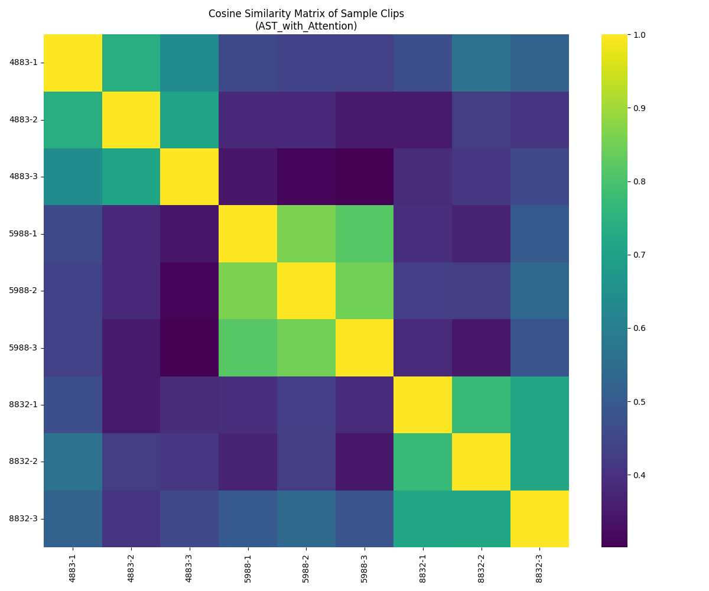  
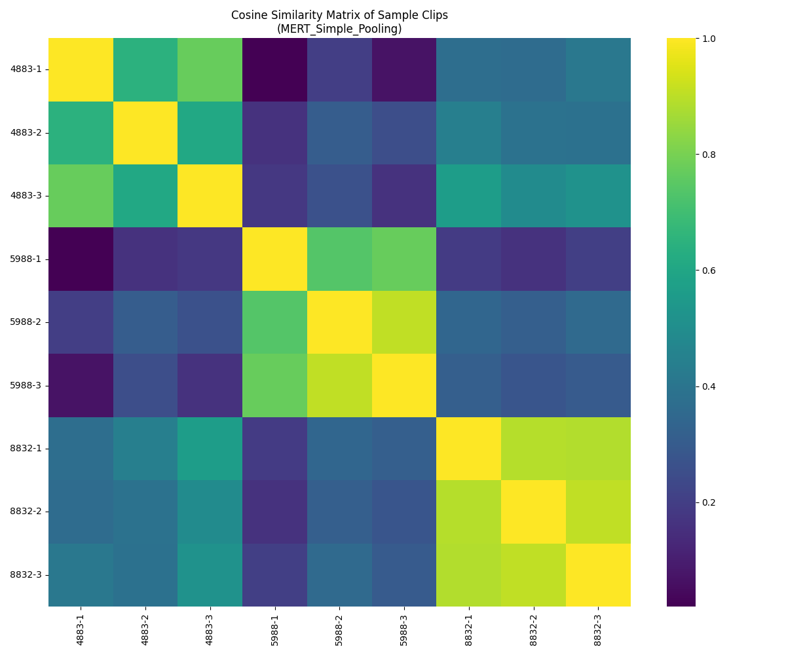  
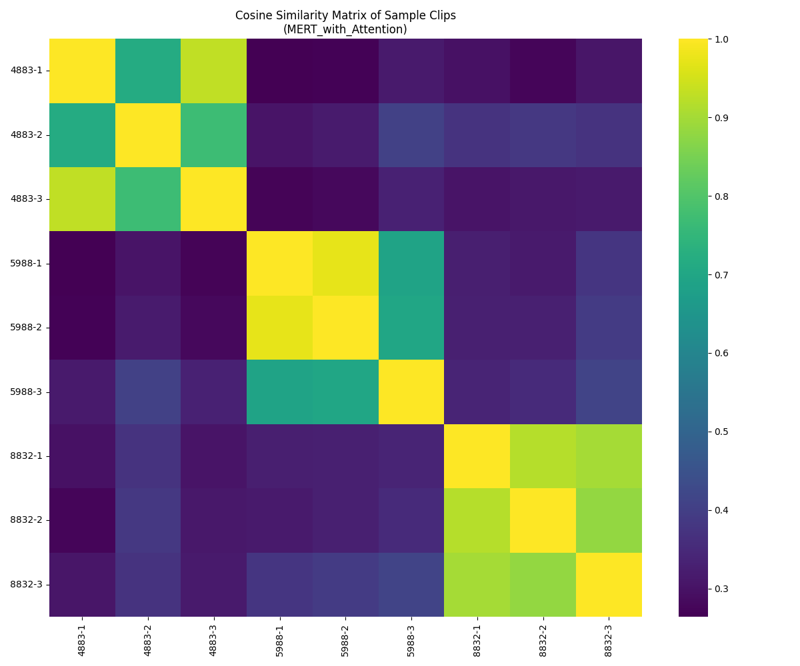

---

## Conclusions

We compared a classical landmark-based audio fingerprinting pipeline against modern deep learning (CNN) and large pretrained transformer models (AST, MERT) for song identification:

- **Classical fingerprinting** remains outstanding on clean, short clips (Top-1 up to **94%** at 5 s), fast and robust to partial matches.
- **CNNs** benefit from depth and hybrid losses but trail transformers; best enhanced CNN reached **~71%** Top-1 on clean 5 s.
- **Pretrained transformers** shine: **AST** outperforms CNNs; **MERT** (music-specific SSL) is best overall, with **~84.5–86.5%** Top-1 on clean 5 s and **strong noise robustness**.
- **Generalization** from tuning to held-out test is stable across methods.
- **Embeddings** exhibit clear structure (similarity distributions and t-SNE), supporting retrieval-style song ID.

**Future directions:** fuse classical fingerprints with learned embeddings, and explore larger or domain-specialized pretrained backbones for even stronger performance.

